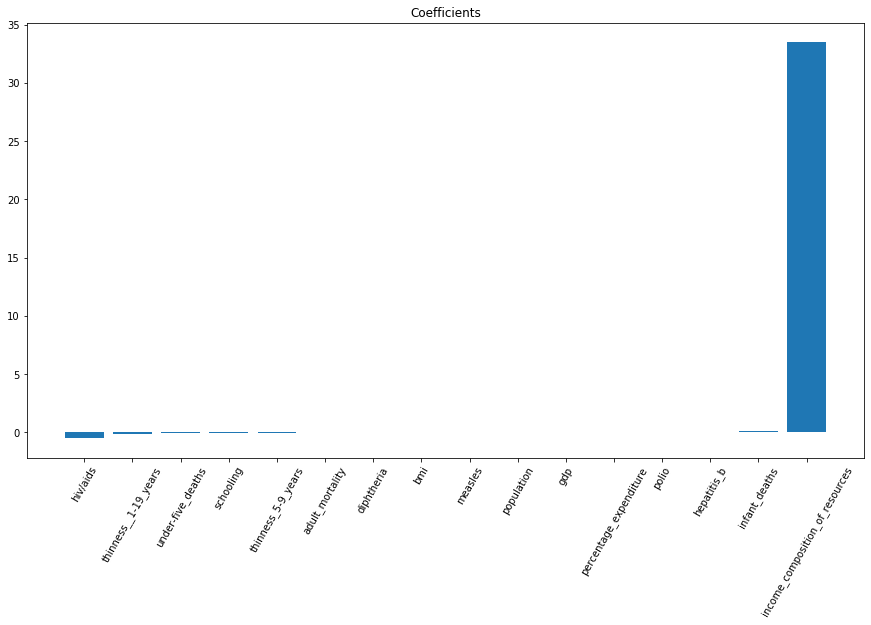
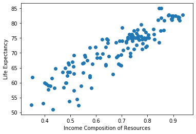
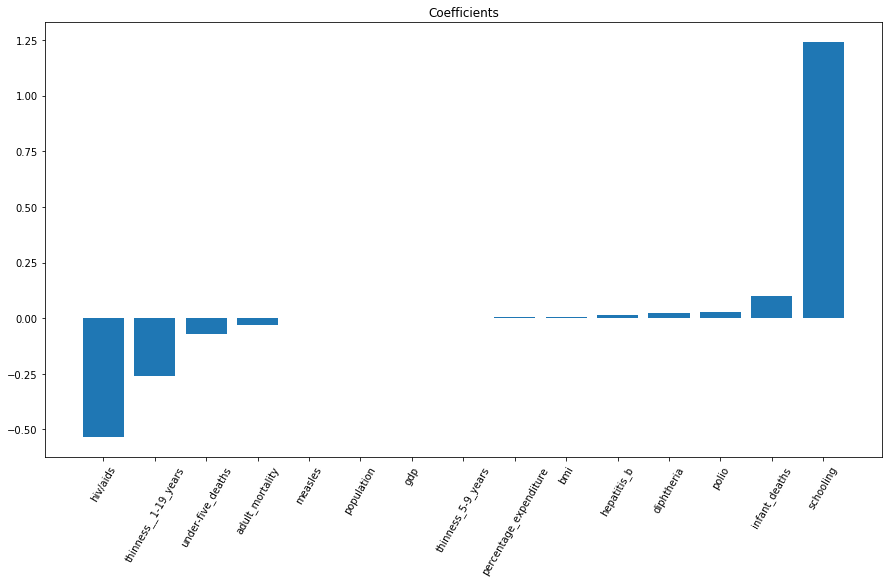

# Linear Regression

This morning's warmup will more a codealong.

Since we're nearing the end of mod project, let's make sure we have the code down for fitting a linear regression model!

Below we import life expectancy data for 193 countries from 2000-2015.


```python
import pandas as pd

df = pd.read_csv('https://gist.githubusercontent.com/joelsewhere/a61e90c0d88cddb052975d65835bc339/raw/20743a0ea41fae58dbee2f166e5d0af56a5f4242/life_expectancy.csv')
```

For this warmup, let's:
- Limit the dataset to the year 2015
- Remove all columns containing strings
- Lower the column names and replace spaces with underscores


```python
df = df[df.Year == 2015]
df = df.select_dtypes(exclude=['object'])
df.columns = [x.lower().strip().replace(' ', '_') for x in df.columns]
```

Great, let's make sure we don't have any null values!


```python
df.info()
```

    <class 'pandas.core.frame.DataFrame'>
    Int64Index: 183 entries, 0 to 2922
    Data columns (total 20 columns):
    year                               183 non-null int64
    life_expectancy                    183 non-null float64
    adult_mortality                    183 non-null float64
    infant_deaths                      183 non-null int64
    alcohol                            6 non-null float64
    percentage_expenditure             183 non-null float64
    hepatitis_b                        174 non-null float64
    measles                            183 non-null int64
    bmi                                181 non-null float64
    under-five_deaths                  183 non-null int64
    polio                              183 non-null float64
    total_expenditure                  2 non-null float64
    diphtheria                         183 non-null float64
    hiv/aids                           183 non-null float64
    gdp                                154 non-null float64
    population                         142 non-null float64
    thinness__1-19_years               181 non-null float64
    thinness_5-9_years                 181 non-null float64
    income_composition_of_resources    173 non-null float64
    schooling                          173 non-null float64
    dtypes: float64(16), int64(4)
    memory usage: 30.0 KB


# $Yikes$

Ok, let's first drop the ```alcohol``` and ```total_expenditure``` columns.

Once we've done that we can drop any other rows that have null values. 

We will also drop our ```year``` column for now.


```python
df.drop(['alcohol', 'total_expenditure', 'year'], axis = 1, inplace = True)
df.dropna(inplace=True)
```

Next we need to isolate out X and y data.

For this dataset, the column ```life_expectancy``` is our target column *(our y column)*


```python
X = df.drop('life_expectancy', axis=1)
y = df['life_expectancy']
```

Ok, now in the cell below import ```statsmodels.api as sm```.


```python
import statsmodels.api as sm
```

And then we fit out model!


```python
model = sm.OLS(y, X).fit()
model.summary()
```


<table class="simpletable">
<caption>OLS Regression Results</caption>
<tr>
  <th>Dep. Variable:</th>     <td>life_expectancy</td> <th>  R-squared (uncentered):</th>      <td>   0.993</td> 
</tr>
<tr>
  <th>Model:</th>                   <td>OLS</td>       <th>  Adj. R-squared (uncentered):</th> <td>   0.992</td> 
</tr>
<tr>
  <th>Method:</th>             <td>Least Squares</td>  <th>  F-statistic:       </th>          <td>   999.2</td> 
</tr>
<tr>
  <th>Date:</th>             <td>Thu, 11 Jun 2020</td> <th>  Prob (F-statistic):</th>          <td>1.68e-114</td>
</tr>
<tr>
  <th>Time:</th>                 <td>01:21:40</td>     <th>  Log-Likelihood:    </th>          <td> -417.18</td> 
</tr>
<tr>
  <th>No. Observations:</th>      <td>   130</td>      <th>  AIC:               </th>          <td>   866.4</td> 
</tr>
<tr>
  <th>Df Residuals:</th>          <td>   114</td>      <th>  BIC:               </th>          <td>   912.2</td> 
</tr>
<tr>
  <th>Df Model:</th>              <td>    16</td>      <th>                     </th>              <td> </td>    
</tr>
<tr>
  <th>Covariance Type:</th>      <td>nonrobust</td>    <th>                     </th>              <td> </td>    
</tr>
</table>
<table class="simpletable">
<tr>
                 <td></td>                    <th>coef</th>     <th>std err</th>      <th>t</th>      <th>P>|t|</th>  <th>[0.025</th>    <th>0.975]</th>  
</tr>
<tr>
  <th>adult_mortality</th>                 <td>    0.0128</td> <td>    0.008</td> <td>    1.643</td> <td> 0.103</td> <td>   -0.003</td> <td>    0.028</td>
</tr>
<tr>
  <th>infant_deaths</th>                   <td>   -0.0887</td> <td>    0.076</td> <td>   -1.162</td> <td> 0.248</td> <td>   -0.240</td> <td>    0.062</td>
</tr>
<tr>
  <th>percentage_expenditure</th>          <td>    0.0069</td> <td>    0.017</td> <td>    0.394</td> <td> 0.694</td> <td>   -0.028</td> <td>    0.041</td>
</tr>
<tr>
  <th>hepatitis_b</th>                     <td>    0.0489</td> <td>    0.054</td> <td>    0.912</td> <td> 0.363</td> <td>   -0.057</td> <td>    0.155</td>
</tr>
<tr>
  <th>measles</th>                         <td>  4.99e-05</td> <td>    0.000</td> <td>    0.369</td> <td> 0.713</td> <td>   -0.000</td> <td>    0.000</td>
</tr>
<tr>
  <th>bmi</th>                             <td>    0.0029</td> <td>    0.037</td> <td>    0.080</td> <td> 0.936</td> <td>   -0.070</td> <td>    0.076</td>
</tr>
<tr>
  <th>under-five_deaths</th>               <td>    0.0568</td> <td>    0.055</td> <td>    1.036</td> <td> 0.302</td> <td>   -0.052</td> <td>    0.165</td>
</tr>
<tr>
  <th>polio</th>                           <td>    0.0411</td> <td>    0.030</td> <td>    1.371</td> <td> 0.173</td> <td>   -0.018</td> <td>    0.100</td>
</tr>
<tr>
  <th>diphtheria</th>                      <td>    0.0151</td> <td>    0.062</td> <td>    0.243</td> <td> 0.808</td> <td>   -0.108</td> <td>    0.138</td>
</tr>
<tr>
  <th>hiv/aids</th>                        <td>    0.3207</td> <td>    0.524</td> <td>    0.612</td> <td> 0.541</td> <td>   -0.717</td> <td>    1.358</td>
</tr>
<tr>
  <th>gdp</th>                             <td>   -0.0002</td> <td>  6.7e-05</td> <td>   -2.871</td> <td> 0.005</td> <td>   -0.000</td> <td>-5.97e-05</td>
</tr>
<tr>
  <th>population</th>                      <td> 4.223e-09</td> <td> 2.27e-08</td> <td>    0.186</td> <td> 0.853</td> <td>-4.07e-08</td> <td> 4.92e-08</td>
</tr>
<tr>
  <th>thinness__1-19_years</th>            <td>    0.3341</td> <td>    0.553</td> <td>    0.604</td> <td> 0.547</td> <td>   -0.762</td> <td>    1.430</td>
</tr>
<tr>
  <th>thinness_5-9_years</th>              <td>    0.4688</td> <td>    0.540</td> <td>    0.868</td> <td> 0.387</td> <td>   -0.601</td> <td>    1.539</td>
</tr>
<tr>
  <th>income_composition_of_resources</th> <td>   78.5533</td> <td>   10.841</td> <td>    7.246</td> <td> 0.000</td> <td>   57.076</td> <td>  100.030</td>
</tr>
<tr>
  <th>schooling</th>                       <td>    0.2954</td> <td>    0.566</td> <td>    0.522</td> <td> 0.602</td> <td>   -0.825</td> <td>    1.416</td>
</tr>
</table>
<table class="simpletable">
<tr>
  <th>Omnibus:</th>       <td> 2.667</td> <th>  Durbin-Watson:     </th> <td>   2.107</td>
</tr>
<tr>
  <th>Prob(Omnibus):</th> <td> 0.264</td> <th>  Jarque-Bera (JB):  </th> <td>   2.468</td>
</tr>
<tr>
  <th>Skew:</th>          <td> 0.337</td> <th>  Prob(JB):          </th> <td>   0.291</td>
</tr>
<tr>
  <th>Kurtosis:</th>      <td> 2.985</td> <th>  Cond. No.          </th> <td>6.24e+08</td>
</tr>
</table><br/><br/>Warnings:<br/>[1] Standard Errors assume that the covariance matrix of the errors is correctly specified.<br/>[2] The condition number is large, 6.24e+08. This might indicate that there are<br/>strong multicollinearity or other numerical problems.


**How well is our model explaining the variance of our data?**


```python

```

**Before we go, let's fit an sklearn model as well.**


```python
from sklearn.linear_model import LinearRegression
import sklearn.metrics as metrics
```

First we create a model object.


```python
lr = LinearRegression()
```


    LinearRegression(copy_X=True, fit_intercept=True, n_jobs=None, normalize=False)


Then we fit the model object on our X, and y data.


```python
lr.fit(X, y)
```

Next we use the model to predict values for our X data.


```python
y_hat = lr.predict(X)
```

Then we compare our predictions to the actual y values


```python
metrics.r2_score(y, y_hat)
```


    0.9008630576092219


Now let's plot our coefficients!


```python
def plot_coefficients(column_names, coefficients):
    plt.figure(figsize=(15,8))
    zipped = list(zip(column_names,coefficients))
    zipped = sorted(zipped, key= lambda x: x[1])
    
    xaxis = [x[0] for x in zipped]
    yaxis = [x[1] for x in zipped]
    
    plt.bar(xaxis, yaxis)
    plt.xticks(rotation=60)
    plt.title('Coefficients')
```


```python
plot_coefficients(X.columns, lr.coef_)
```





There are some major differences between the coefficients. It might be beneficial to scale our data using Sklearn's Standard Scaler.


```python
from sklearn import preprocessing
```


```python
scaler = preprocessing.StandardScaler()
X_scaled = scaler.fit_transform(X)
X_scaled = pd.DataFrame(X, columns = X.columns)
```

To speed things up, let's compile out modeling code into functions


```python
def OLS(X, y):
    return sm.OLS(y, X).fit()

def linear_regression(X,y):
    lr = LinearRegression()
    lr.fit(X, y)
    y_hat = lr.predict(X)
    r_squared = metrics.r2_score(y, y_hat)
    print("R^2:", r_squared)
    plot_coefficients(X.columns, lr.coef_)
    return lr
```


```python
OLS(X_scaled, y).summary()
```


<table class="simpletable">
<caption>OLS Regression Results</caption>
<tr>
  <th>Dep. Variable:</th>     <td>life_expectancy</td> <th>  R-squared (uncentered):</th>      <td>   0.993</td> 
</tr>
<tr>
  <th>Model:</th>                   <td>OLS</td>       <th>  Adj. R-squared (uncentered):</th> <td>   0.992</td> 
</tr>
<tr>
  <th>Method:</th>             <td>Least Squares</td>  <th>  F-statistic:       </th>          <td>   999.2</td> 
</tr>
<tr>
  <th>Date:</th>             <td>Thu, 11 Jun 2020</td> <th>  Prob (F-statistic):</th>          <td>1.68e-114</td>
</tr>
<tr>
  <th>Time:</th>                 <td>01:35:01</td>     <th>  Log-Likelihood:    </th>          <td> -417.18</td> 
</tr>
<tr>
  <th>No. Observations:</th>      <td>   130</td>      <th>  AIC:               </th>          <td>   866.4</td> 
</tr>
<tr>
  <th>Df Residuals:</th>          <td>   114</td>      <th>  BIC:               </th>          <td>   912.2</td> 
</tr>
<tr>
  <th>Df Model:</th>              <td>    16</td>      <th>                     </th>              <td> </td>    
</tr>
<tr>
  <th>Covariance Type:</th>      <td>nonrobust</td>    <th>                     </th>              <td> </td>    
</tr>
</table>
<table class="simpletable">
<tr>
                 <td></td>                    <th>coef</th>     <th>std err</th>      <th>t</th>      <th>P>|t|</th>  <th>[0.025</th>    <th>0.975]</th>  
</tr>
<tr>
  <th>adult_mortality</th>                 <td>    0.0128</td> <td>    0.008</td> <td>    1.643</td> <td> 0.103</td> <td>   -0.003</td> <td>    0.028</td>
</tr>
<tr>
  <th>infant_deaths</th>                   <td>   -0.0887</td> <td>    0.076</td> <td>   -1.162</td> <td> 0.248</td> <td>   -0.240</td> <td>    0.062</td>
</tr>
<tr>
  <th>percentage_expenditure</th>          <td>    0.0069</td> <td>    0.017</td> <td>    0.394</td> <td> 0.694</td> <td>   -0.028</td> <td>    0.041</td>
</tr>
<tr>
  <th>hepatitis_b</th>                     <td>    0.0489</td> <td>    0.054</td> <td>    0.912</td> <td> 0.363</td> <td>   -0.057</td> <td>    0.155</td>
</tr>
<tr>
  <th>measles</th>                         <td>  4.99e-05</td> <td>    0.000</td> <td>    0.369</td> <td> 0.713</td> <td>   -0.000</td> <td>    0.000</td>
</tr>
<tr>
  <th>bmi</th>                             <td>    0.0029</td> <td>    0.037</td> <td>    0.080</td> <td> 0.936</td> <td>   -0.070</td> <td>    0.076</td>
</tr>
<tr>
  <th>under-five_deaths</th>               <td>    0.0568</td> <td>    0.055</td> <td>    1.036</td> <td> 0.302</td> <td>   -0.052</td> <td>    0.165</td>
</tr>
<tr>
  <th>polio</th>                           <td>    0.0411</td> <td>    0.030</td> <td>    1.371</td> <td> 0.173</td> <td>   -0.018</td> <td>    0.100</td>
</tr>
<tr>
  <th>diphtheria</th>                      <td>    0.0151</td> <td>    0.062</td> <td>    0.243</td> <td> 0.808</td> <td>   -0.108</td> <td>    0.138</td>
</tr>
<tr>
  <th>hiv/aids</th>                        <td>    0.3207</td> <td>    0.524</td> <td>    0.612</td> <td> 0.541</td> <td>   -0.717</td> <td>    1.358</td>
</tr>
<tr>
  <th>gdp</th>                             <td>   -0.0002</td> <td>  6.7e-05</td> <td>   -2.871</td> <td> 0.005</td> <td>   -0.000</td> <td>-5.97e-05</td>
</tr>
<tr>
  <th>population</th>                      <td> 4.223e-09</td> <td> 2.27e-08</td> <td>    0.186</td> <td> 0.853</td> <td>-4.07e-08</td> <td> 4.92e-08</td>
</tr>
<tr>
  <th>thinness__1-19_years</th>            <td>    0.3341</td> <td>    0.553</td> <td>    0.604</td> <td> 0.547</td> <td>   -0.762</td> <td>    1.430</td>
</tr>
<tr>
  <th>thinness_5-9_years</th>              <td>    0.4688</td> <td>    0.540</td> <td>    0.868</td> <td> 0.387</td> <td>   -0.601</td> <td>    1.539</td>
</tr>
<tr>
  <th>income_composition_of_resources</th> <td>   78.5533</td> <td>   10.841</td> <td>    7.246</td> <td> 0.000</td> <td>   57.076</td> <td>  100.030</td>
</tr>
<tr>
  <th>schooling</th>                       <td>    0.2954</td> <td>    0.566</td> <td>    0.522</td> <td> 0.602</td> <td>   -0.825</td> <td>    1.416</td>
</tr>
</table>
<table class="simpletable">
<tr>
  <th>Omnibus:</th>       <td> 2.667</td> <th>  Durbin-Watson:     </th> <td>   2.107</td>
</tr>
<tr>
  <th>Prob(Omnibus):</th> <td> 0.264</td> <th>  Jarque-Bera (JB):  </th> <td>   2.468</td>
</tr>
<tr>
  <th>Skew:</th>          <td> 0.337</td> <th>  Prob(JB):          </th> <td>   0.291</td>
</tr>
<tr>
  <th>Kurtosis:</th>      <td> 2.985</td> <th>  Cond. No.          </th> <td>6.24e+08</td>
</tr>
</table><br/><br/>Warnings:<br/>[1] Standard Errors assume that the covariance matrix of the errors is correctly specified.<br/>[2] The condition number is large, 6.24e+08. This might indicate that there are<br/>strong multicollinearity or other numerical problems.


```python
linear_regression(X_scaled, y)
```

    R^2: 0.9008630576092219


    LinearRegression(copy_X=True, fit_intercept=True, n_jobs=None, normalize=False)


No change! Let's take a look at the relationship between income_composition_of_resources and our target.


```python
plt.scatter(df.income_composition_of_resources, df.life_expectancy)
plt.ylabel('Life Expectancy')
plt.xlabel('Income Composition of Resources');
```





Let's see what happens to our coefficients if we drop this column.


```python
X_scaled.drop('income_composition_of_resources', axis = 1, inplace = True)
```


```python
linear_regression(X_scaled, y);
```

    R^2: 0.8609382489399316





```python
OLS(X_scaled, y).summary()
```


<table class="simpletable">
<caption>OLS Regression Results</caption>
<tr>
  <th>Dep. Variable:</th>     <td>life_expectancy</td> <th>  R-squared (uncentered):</th>      <td>   0.990</td> 
</tr>
<tr>
  <th>Model:</th>                   <td>OLS</td>       <th>  Adj. R-squared (uncentered):</th> <td>   0.988</td> 
</tr>
<tr>
  <th>Method:</th>             <td>Least Squares</td>  <th>  F-statistic:       </th>          <td>   733.7</td> 
</tr>
<tr>
  <th>Date:</th>             <td>Thu, 11 Jun 2020</td> <th>  Prob (F-statistic):</th>          <td>1.42e-106</td>
</tr>
<tr>
  <th>Time:</th>                 <td>01:40:17</td>     <th>  Log-Likelihood:    </th>          <td> -441.80</td> 
</tr>
<tr>
  <th>No. Observations:</th>      <td>   130</td>      <th>  AIC:               </th>          <td>   913.6</td> 
</tr>
<tr>
  <th>Df Residuals:</th>          <td>   115</td>      <th>  BIC:               </th>          <td>   956.6</td> 
</tr>
<tr>
  <th>Df Model:</th>              <td>    15</td>      <th>                     </th>              <td> </td>    
</tr>
<tr>
  <th>Covariance Type:</th>      <td>nonrobust</td>    <th>                     </th>              <td> </td>    
</tr>
</table>
<table class="simpletable">
<tr>
             <td></td>               <th>coef</th>     <th>std err</th>      <th>t</th>      <th>P>|t|</th>  <th>[0.025</th>    <th>0.975]</th>  
</tr>
<tr>
  <th>adult_mortality</th>        <td>    0.0007</td> <td>    0.009</td> <td>    0.075</td> <td> 0.940</td> <td>   -0.017</td> <td>    0.019</td>
</tr>
<tr>
  <th>infant_deaths</th>          <td>   -0.0423</td> <td>    0.091</td> <td>   -0.462</td> <td> 0.645</td> <td>   -0.224</td> <td>    0.139</td>
</tr>
<tr>
  <th>percentage_expenditure</th> <td>    0.0046</td> <td>    0.021</td> <td>    0.219</td> <td> 0.827</td> <td>   -0.037</td> <td>    0.046</td>
</tr>
<tr>
  <th>hepatitis_b</th>            <td>   -0.0283</td> <td>    0.063</td> <td>   -0.448</td> <td> 0.655</td> <td>   -0.153</td> <td>    0.097</td>
</tr>
<tr>
  <th>measles</th>                <td>-5.738e-05</td> <td>    0.000</td> <td>   -0.354</td> <td> 0.724</td> <td>   -0.000</td> <td>    0.000</td>
</tr>
<tr>
  <th>bmi</th>                    <td>    0.0503</td> <td>    0.043</td> <td>    1.158</td> <td> 0.249</td> <td>   -0.036</td> <td>    0.137</td>
</tr>
<tr>
  <th>under-five_deaths</th>      <td>    0.0306</td> <td>    0.066</td> <td>    0.466</td> <td> 0.642</td> <td>   -0.100</td> <td>    0.161</td>
</tr>
<tr>
  <th>polio</th>                  <td>    0.0921</td> <td>    0.035</td> <td>    2.631</td> <td> 0.010</td> <td>    0.023</td> <td>    0.162</td>
</tr>
<tr>
  <th>diphtheria</th>             <td>    0.1120</td> <td>    0.073</td> <td>    1.531</td> <td> 0.129</td> <td>   -0.033</td> <td>    0.257</td>
</tr>
<tr>
  <th>hiv/aids</th>               <td>    0.4156</td> <td>    0.630</td> <td>    0.660</td> <td> 0.511</td> <td>   -0.832</td> <td>    1.663</td>
</tr>
<tr>
  <th>gdp</th>                    <td>   -0.0002</td> <td> 8.06e-05</td> <td>   -2.617</td> <td> 0.010</td> <td>   -0.000</td> <td>-5.13e-05</td>
</tr>
<tr>
  <th>population</th>             <td> 1.428e-08</td> <td> 2.72e-08</td> <td>    0.524</td> <td> 0.601</td> <td>-3.97e-08</td> <td> 6.83e-08</td>
</tr>
<tr>
  <th>thinness__1-19_years</th>   <td>    0.0888</td> <td>    0.664</td> <td>    0.134</td> <td> 0.894</td> <td>   -1.227</td> <td>    1.405</td>
</tr>
<tr>
  <th>thinness_5-9_years</th>     <td>    0.7005</td> <td>    0.649</td> <td>    1.080</td> <td> 0.283</td> <td>   -0.585</td> <td>    1.986</td>
</tr>
<tr>
  <th>schooling</th>              <td>    3.9600</td> <td>    0.304</td> <td>   13.006</td> <td> 0.000</td> <td>    3.357</td> <td>    4.563</td>
</tr>
</table>
<table class="simpletable">
<tr>
  <th>Omnibus:</th>       <td> 3.546</td> <th>  Durbin-Watson:     </th> <td>   2.092</td>
</tr>
<tr>
  <th>Prob(Omnibus):</th> <td> 0.170</td> <th>  Jarque-Bera (JB):  </th> <td>   3.552</td>
</tr>
<tr>
  <th>Skew:</th>          <td> 0.395</td> <th>  Prob(JB):          </th> <td>   0.169</td>
</tr>
<tr>
  <th>Kurtosis:</th>      <td> 2.821</td> <th>  Cond. No.          </th> <td>4.46e+07</td>
</tr>
</table><br/><br/>Warnings:<br/>[1] Standard Errors assume that the covariance matrix of the errors is correctly specified.<br/>[2] The condition number is large, 4.46e+07. This might indicate that there are<br/>strong multicollinearity or other numerical problems.


```python

```
